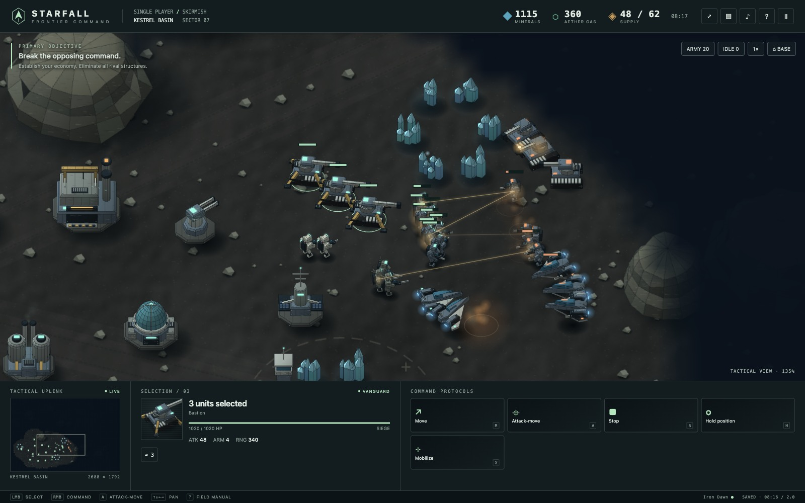
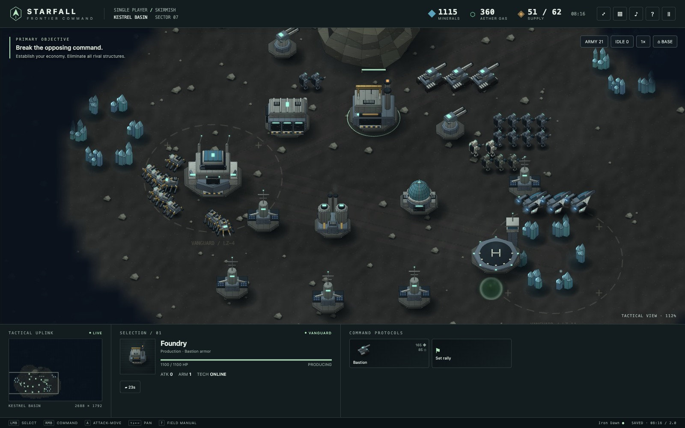
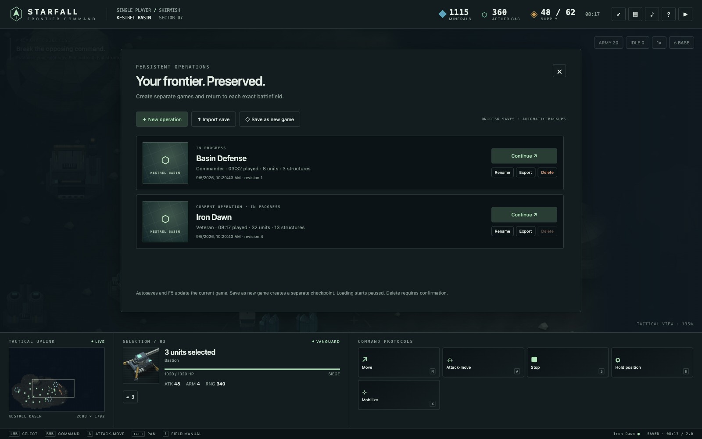

# Starfall Command

### Build your base. Break theirs.

A single-player sci-fi RTS about turning a mining outpost into a war machine. Build an economy, field a mixed army, and push through the fog to wipe the rival legion off the map.

**Siege tanks. Precision infantry. Aircraft. An enemy that keeps building while you're making up your mind.**

[**Download the game →**](https://github.com/agustinsacco/starfall-command/releases/latest) · [Your first five minutes](#your-first-five-minutes) · [Controls](#controls) · [Build from source](#development)



_Single-player vs. the computer · macOS, Linux & Windows · Plays offline · No account required_

## The good part is the decision

Another worker, or another rifle? Rush the Foundry, or get more bodies on the line? Push now, or wait for that last tank?

Starfall puts you in charge of both sides of the problem: keeping a base productive and keeping an army alive. You can have the better force and still lose because you stopped replacing workers. You can have a smaller force and make it count with range, healing, and a well-timed push.

- **Build a working base.** Drones haul minerals, harvest gas, construct buildings, and repair damage. Workers aren't a passive income counter: keep them alive and give them something useful to do.
- **Make the units work together.** Deploy Bastions into long-range siege mode. Screen them with Rangers. Keep Menders close. Send Wraiths over terrain that stops your ground army.
- **Fight for what you can see.** Scout beyond the fog, secure another mineral field, and pick your approach. Unexplored ground stays unknown; enemies can disappear back into the fog.
- **Keep the pressure on.** The computer mines, builds, researches, and sends attack waves. Leave it alone long enough and infantry won't be your only problem.

Three difficulties—**Cadet, Commander, and Veteran**—let you learn the economy before asking it to survive under pressure.

## An outpost is only the start



Start with a Command Spire, a handful of workers, and two Rangers. Expand through **eight structures**: supply, gas extraction, infantry production, armor, aircraft, research, and static defense.

Research stronger weapons, tougher plating, and faster movement. Queue reinforcements and rally them toward the front. Keep building while your army is out fighting—the battlefield does not wait for you to finish managing the base.

### Know what you're sending in

| Unit        | What it's for                                                                            |
| ----------- | ---------------------------------------------------------------------------------------- |
| **Drone**   | Build, gather, repair. Your economy has legs.                                            |
| **Ranger**  | Dependable rifle infantry. The backbone of an early push.                                |
| **Lancer**  | Long-range precision damage. Keep something tougher in front.                            |
| **Mender**  | Automatic healing for nearby allies. Give your army staying power.                       |
| **Bastion** | Heavy armor that deploys into siege artillery. Powerful at range; cannot shoot aircraft. |
| **Wraith**  | Fast aircraft that fly over obstacles. Take a different route to the fight.              |

[Inspect the full unit and structure roster →](assets/generated/roster.png)

## A skirmish, not a commitment

Pause when you need to think. Save when you need to leave. Return to the same battlefield—not a reset mission or an approximation of where you were.



- **Keep multiple games.** Name your operations and switch between them in the library.
- **Come back mid-fight.** Units, orders, paths, cargo, production, research, fog, AI state, camera, selection, and control groups are saved.
- **Try a different plan.** “Save as new game” creates an independent checkpoint without overwriting your current operation.
- **Less lost progress.** Autosave every 30 seconds while playing, manual save with **F5**, and save-before-quit. Each operation keeps a previous-good backup.
- **Take your saves with you.** Export/import portable save files. Loading starts paused, so you can get your bearings.

Force-quitting or losing power can only recover the last successfully committed save. There is no cloud sync.

## Install

[**Get the latest release**](https://github.com/agustinsacco/starfall-command/releases/latest)

| Your machine            | Download                           |
| ----------------------- | ---------------------------------- |
| **Mac · Apple Silicon** | `mac-arm64.dmg` or `mac-arm64.zip` |
| **Mac · Intel**         | `mac-x64.dmg` or `mac-x64.zip`     |
| **Linux · x64 / arm64** | The matching `.AppImage` or `.deb` |
| **Windows · x64**       | The `.exe` installer               |

The app includes its runtime. You do **not** need Node.js to play.

**macOS / Linux, from a terminal:**

```sh
curl -fsSL https://github.com/agustinsacco/starfall-command/releases/latest/download/install.sh | sh
```

The installer checks its downloads and preserves saved operations. Save and quit before upgrading, then rerun it to get the latest version. No in-app automatic updater is included.

> **First launch:** Mac builds are ad-hoc signed unless Apple credentials are configured; macOS may require **Privacy & Security → Open Anyway**. Windows builds are unsigned and may trigger SmartScreen. The installer does not disable system security protections. [Installation, signing, and rollback details →](docs/RELEASING.md)

## Your first five minutes

1. **Name an operation and deploy.** Choose Cadet for your first match. The game opens fullscreen; **F11** switches to a window.
2. **Get the economy moving.** Your starting drones already mine. Train more at the Command Spire. Build an Extractor on a gas vent and assign workers to it.
3. **Keep making units.** Train Rangers at the Infantry Bay. Build Supply Relays before you run out of room.
4. **Add a reason to fear your army.** A Research Lab unlocks Lancers and Menders. A Foundry brings Bastions; a Flight Deck brings Wraiths.
5. **Scout, then push.** Select your army with **F2**, press **A**, and click a destination to attack-move. Destroy **every enemy structure** to win. Your headquarters isn't the only building that counts—and neither is theirs.

Press **?** in-game for the field manual. Mouse and keyboard recommended.

## Controls

| Input                                    | Order                                              |
| ---------------------------------------- | -------------------------------------------------- |
| Click / drag                             | Select / box-select                                |
| Shift + select / double-click            | Add to selection / select visible units of a class |
| Right-click                              | Move, attack, gather, repair, or set a rally point |
| **A** → click / **M** → click            | Attack-move / move without auto-attacking          |
| **B**                                    | Selected drone's build palette                     |
| **S** / **H** / **X**                    | Stop / hold / toggle Bastion siege                 |
| **F2** / **I**                           | Select your combat army / next idle drone          |
| Ctrl/Cmd + **1–5** / **1–5**             | Assign / recall a control group                    |
| Arrows / middle-drag / two-finger scroll | Pan the map                                        |
| Pinch, mouse wheel, or Cmd/Ctrl + scroll | Zoom                                               |
| Space / **P**                            | Center selection / pause                           |
| **F5** / **F9** / **F11**                | Save / game library / fullscreen                   |

## What's in this build

**One battlefield: Kestrel Basin. Six unit classes. Eight structures. Three AI difficulties.** Original shaded 2.5D models, animated units, smoke, tracers, explosions, and a complete desktop skirmish loop.

Both sides use the same technology. This is an original RTS inspired by the genre's classics—not a StarCraft remake. No campaign, multiplayer, distinct faction tech trees, or full 3D engine is included. Mission seeds change surface detail and the AI's random sequence, not the map layout.

_Screenshots are captured from the actual game renderer. The armies, base layout, and sample operations are staged to showcase available gameplay—not painted mockups. No StarCraft assets are used._

<details>
<summary><strong>Already have a browser save?</strong></summary>

Open the updated `index.html` in the same browser and file location you used before. The old `starfall-save-v1` slot migrates into that browser's game library without deleting the original. Export it there, then import it into Electron. Desktop and browser storage are separate.

`index.html` also remains a playable browser fallback when kept with `src/` and `assets/`. The desktop app is the recommended way to play.

</details>

<details>
<summary><strong>Where are my games saved?</strong></summary>

Operations live in `Starfall Command/operations/` under your platform's application-data directory. On macOS:

```text
~/Library/Application Support/Starfall Command/operations/
```

Each named operation has its own UUID file and previous-good `.bak` backup. Saves are validated and checksummed; replacing the app does not replace this directory. Export important games before rolling back to an older app version.

</details>

## Development

Requires Node.js 22+. Electron and electron-builder are pinned development dependencies; gameplay uses no third-party runtime modules.

```sh
npm ci
npm start

npm run check
npm test
npm run test:browser
npm run test:electron
```

CI checks the game and builds installers on macOS, Linux, and Windows. The full native gameplay/save/relaunch and Chrome UI suites run on Mac. Releases publish the exact tested artifacts only when the complete platform set passes.

- [Packaging, releases, signing and rollback](docs/RELEASING.md)
- [Simulation](src/simulation.js) · [Procedural artwork](src/art.js) · [Save storage](electron/save-store.cjs)
- [Component library](assets/README.md)
- Regenerate these screenshots: `node scripts/capture-showcase.mjs` (uses a temporary profile, never your saved games).

---

**Enough planning. [Take the basin. →](https://github.com/agustinsacco/starfall-command/releases/latest)**
